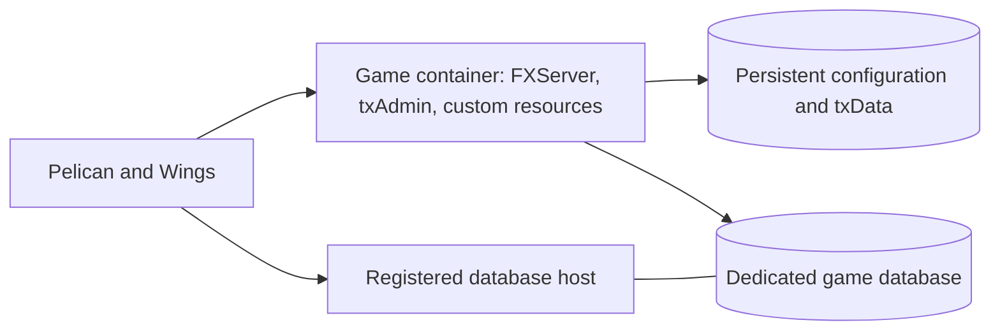

# Open Freemode

A public-source project designing a GTA Online-like freemode experience for **FiveM for GTA V Enhanced**, with reproducible **Pelican** deployments.

**Status: planning.** This repository contains the design, contribution rules, example configuration contract, and a secret-scanning workflow. It does not yet contain a playable gamemode, a Docker image, or an importable Pelican egg. The example settings are not an installer.

## Project direction

- Target current GTA Online behavior, delivered in phases.
- Match normal prices, payouts, and unlock requirements using dated reference evidence.
- Target Enhanced first and verify every selected dependency against it.
- Package the game runtime and custom resources as one image per release.
- Use one external MySQL/MariaDB database provisioned through Pelican Database Hosts for each deployed server.
- Publish original code, image build definitions, eggs, migrations, tests, and instructions so other operators can reproduce releases.
- Keep deployment credentials, private infrastructure details, player records, and purchased assets outside Git.

Read the [server design](docs/design.md) for architecture, gameplay coverage, phases, and acceptance criteria. Read the [reproducibility plan](docs/reproducibility.md) for publication and release requirements.

## Intended deployment

Operators supply their own Linux amd64 node, supported database service, network allocations, Cfx server entitlement/key, and settings. A second Pelican server with separate data provides staging. Sharing an image does not mean sharing production credentials or player data.

## First implementation milestone

Prove an Enhanced client can join a disposable Pelican deployment, create a persisted test profile, survive a container replacement, and recover from a matched SQL/file backup. Test txAdmin and Pelican shutdown behavior together before adding the economy.

Later phases add characters and progression, the first complete earn/buy/store/retrieve loop, properties and organizations, businesses, and multi-stage activities. Phasing does not imply the remaining catalogue has been dropped.

## Verification today

CI scans Git history for potential secrets. It is **not** a game compatibility test. The design separates proposed behavior from implemented and runtime-verified behavior. See [contribution guidance](CONTRIBUTING.md) before publishing changes.

## License and independence

Original material in this repository is available under the [MIT License](LICENSE). Third-party dependencies retain their own licenses; a link to a project does not relicense it. Rockstar game files and third-party paid or escrow-protected resources are not included.

Open Freemode is an independent community project and is not approved, sponsored, or endorsed by Rockstar Games. Each deployed public server needs its own operator identity/contact and applicable notices. Exact authored content and commercial features require review against the platform's current terms; technical similarity is not a claim of authorization.
