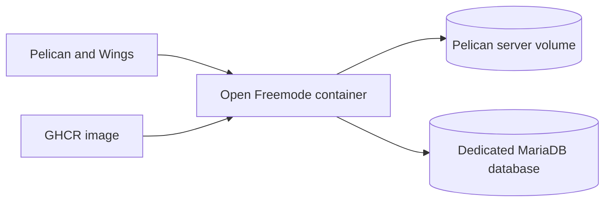

# Open Freemode

Open Freemode is a reproducible FiveM **Legacy** server foundation for four connected activities:

- street and circuit racing;
- team deathmatch;
- cops and robbers pursuits;
- pizza delivery in the shared world.

The project no longer targets a GTA Online recreation. The shared world uses Qbox for characters and persistence, Overextended for inventory and UI primitives, and a deliberately limited vMenu for freely spawning vehicles and weapons while the activities are built.

## Current state

The foundation works today:

- a pinned Linux FXServer runtime downloaded and verified on first start;
- fresh, repeatable MariaDB schema installation;
- Qbox player persistence and vehicle ownership data model;
- Illenium Appearance, ox_inventory, pma-voice and vMenu;
- airport spawn, freemode death recovery and `/guide`;
- tester admission through the `ofm.join` ACE permission;
- immutable resource bundles suitable for Pelican and GHCR updates.

Racing, TDM, pursuits, pizza delivery, owned-vehicle shops/garages and property gameplay are the next milestones. Their names in this repository describe the product direction, not already-shipped gameplay.

Start with [the fresh Pelican installation guide](docs/install.md). No backup import, copied server directory or node-side image build is required.

## Deployment shape

One container runs FXServer and all game resources. MariaDB remains an external Pelican Database Host so its lifecycle and backups stay separate from the game image. See [registry updates](docs/registry.md), [development and verification](docs/development.md), and [the activity architecture](docs/design.md).

## License

Original code in this repository is available under the [MIT License](LICENSE). Pinned third-party resources keep their own licenses and notices; see [third-party dependencies](THIRD_PARTY.md). Rockstar game files and private server credentials are not included.

Open Freemode is an independent community project and is not approved, sponsored or endorsed by Rockstar Games or Cfx.re.
