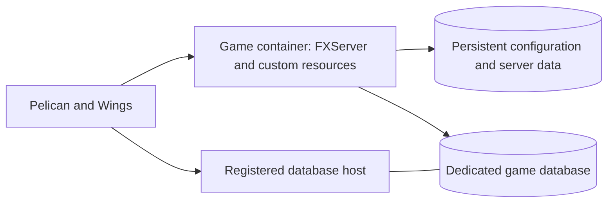

# Open Freemode

A public-source project designing a GTA Online-like freemode experience for **FiveM for GTA V Enhanced**, with reproducible **Pelican** deployments.

**Status: development foundation.** The repository now contains a Dockerfile, generated Pelican egg, launcher, schema initialization, persistent test accounts and a tester-only spawn resource. Local tests cover authenticated Enhanced resource startup, console commands, database outage/recovery, graceful shutdown and restoration of matched SQL/files into separate storage. A real Enhanced client join and a disposable Pelican installation remain unverified. This is not a playable GTA Online recreation yet.

Start with the [development runbook](docs/development.md). Pelican controls FXServer directly; embedded txAdmin is deferred because its Enhanced runtime hangs with Docker's default security profile. No Docker security overrides are required by this package.

## Project direction

- Target current GTA Online behavior, delivered in phases, with classic newcomer onboarding instead of Career Builder.
- Match normal prices, payouts, and unlock requirements using dated reference evidence.
- Target Enhanced first and verify every selected dependency against it.
- Package the game runtime and custom resources as one image per release.
- Use one external MySQL/MariaDB database provisioned through Pelican Database Hosts for each deployed server.
- Publish original code, image build definitions, eggs, migrations, tests, and instructions so other operators can reproduce releases.
- Keep deployment credentials, private infrastructure details, player records, and purchased assets outside Git.
- Reset test progression before the lasting public economy launches.

Read the [server design](docs/design.md) for architecture and full gameplay scope. The detailed plans are:

- [First player experience](docs/first-player-experience.md): classic onboarding, character boundaries, reference capture and the public launch gate.
- [Pelican deployment specification](docs/pelican-deployment-spec.md): installation, configuration ownership, txAdmin, updates and recovery.
- [Implementation plan](docs/implementation-plan.md): dependency approach, ordered work packages and execution evidence still required.
- [Reproducibility plan](docs/reproducibility.md): publication and release requirements.

## Intended deployment

Operators supply their own Linux amd64 node, supported database service, network allocations, Cfx server entitlement/key, and settings. A second Pelican server with separate data provides staging. Sharing an image does not mean sharing production credentials or player data.

## First implementation milestone

Prove an Enhanced client can join a disposable Pelican deployment, create a persisted test profile, survive a container replacement, and recover from a matched SQL/file backup. Verify Pelican console and shutdown behavior before adding the economy. txAdmin compatibility is deferred.

Later phases add characters and progression, the first complete earn/buy/store/retrieve loop, properties and organizations, businesses, and multi-stage activities. Phasing does not imply the remaining catalogue has been dropped.

## Verification today

CI builds the image, exercises a real disposable MariaDB, restores matched SQL/files into an isolated deployment, checks Lua admission decisions with mocked natives, tests launcher failure/cleanup behavior, and probes the native runtime with a synthetic key. It also scans Git history for potential secrets. Authenticated native tests run locally with a private operator-supplied key; neither path proves a game-client session. See the [current evidence and remaining gates](docs/development.md#verification) and [contribution guidance](CONTRIBUTING.md).

## License and independence

Original material in this repository is available under the [MIT License](LICENSE). Third-party dependencies retain their own licenses; a link to a project does not relicense it. Rockstar game files and third-party paid or escrow-protected resources are not included.

Open Freemode is an independent community project and is not approved, sponsored, or endorsed by Rockstar Games. Each deployed public server needs its own operator identity/contact and applicable notices. Exact authored content and commercial features require review against the platform's current terms; technical similarity is not a claim of authorization.
