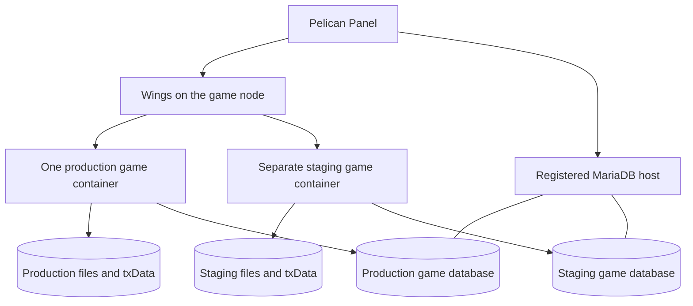

# Public FiveM server design

Planning baseline: 5 September 2026. Status: design for review; no server, image, egg, or database has been deployed or runtime-tested.

## Agreed direction

Build a public FiveM server that reproduces current GTA Online as closely as practical, delivered in phases. Match normal prices, payouts, and unlock requirements. Use classic newcomer onboarding without the Career Builder grant, on the Enhanced client. Target FiveM for GTA V Enhanced first and select compatible resources. Deploy through Pelican using one game-server Docker image and a dedicated MySQL/MariaDB database allocated through Database Hosts. Operators supply their own node and resource limits.

Those are project decisions. The architecture and milestone sequence below are recommendations. An early playable release is a step toward the full target; it does not replace the target with a generic freeroam server.

| Decision | Status | Consequence |
|---|---|---|
| Public community server | Agreed | Persistent progression, moderation, recovery, and concurrency matter from the first beta. |
| Current GTA Online, delivered in phases | Agreed | Maintain a feature inventory and record gaps explicitly. |
| Normal prices, payouts, unlocks | Agreed | Economy changes need reference evidence, not arbitrary balancing multipliers. |
| Classic newcomer opening | Agreed | No Career Builder budget or starter business portfolio; verify tutorial cash/items rather than assuming literally zero. |
| Reset test progression before public launch | Agreed | Fresh production economy; test grants and eligibility do not carry over. |
| Enhanced first | Agreed | Audit server artifacts, natives, UI, voice, and third-party resources for Enhanced. |
| Operator-selected Pelican node | Agreed | Use Wings allocations and persistent storage; inspect installed versions before implementation. |
| One runtime image; external allocated SQL database | Agreed | MariaDB is shared infrastructure outside the game container. |
| Public, reproducible custom work | Agreed | Publish source/build definitions/eggs/migrations and generic instructions; exclude private deployment data. |
| About 30 simultaneous players initially | Proposed | Starting load-test target, not a proven capacity claim or permanent cap. |
| Separate staging and production Pelican servers | Proposed | Same image, distinct storage, databases, credentials, ports, and txAdmin state. |

## What “close to current GTA Online” means

Choose an explicit reference date and game edition for each release. Record permanent updates to prices and rules as new baseline revisions. Keep the reference-data revision separate from the FXServer artifact version: platform updates do not automatically update our economy or missions.

Working interpretation of **normal**: ordinary non-promotional prices and rewards, with earned trade prices and permanent unlocks retained. Temporary weekly discounts, bonus payout events, account-specific grants, and subscription entitlements are tracked separately. Their treatment is a later design decision, not an implicit promise to reproduce Rockstar account services. No official account/progression import is planned.

The chosen opening is an explicit exception to current Enhanced's Career Builder. Players progress through the classic tutorial and earn their way into later content. See the [first-player specification](first-player-experience.md) for evidence, account boundaries and the complete opening. Test progression resets before the public economy starts; ordinary future updates do not imply a wipe.

For each implemented system, compare the complete player experience: prerequisites, entry, controls, prices, objectives, success/failure, rewards, cooldowns, and persistence. A visible business interior is not a working business. A purchasable vehicle without modification persistence, delivery, and loss recovery is not a complete personal-vehicle system.

The reference catalogue will store: feature/item ID; edition; observed date; source or in-game observation; base price; trade price; unlock conditions; reward formula and rounding; cooldown/time basis; ownership prerequisites; and implementation/verification status. Unverified values remain explicitly unknown. For missions, capture factors such as difficulty, participants, elapsed time, bonuses, and repeat eligibility where applicable. Do not substitute a flat reward when the reference uses a formula.

### Coverage register

This is the initial system-level inventory, not a claim to have enumerated every current mission, vehicle, or DLC item. The detailed catalogue is a required first implementation input.

| System family | Fidelity target | First substantial phase |
|---|---|---|
| Characters and onboarding | Appearance, character slots/account rules, starter state, clothing and saved outfits | 1 |
| Progression | Cash/bank behavior, rank/RP, skills, unlocks, awards and prerequisites | 1–2 |
| Freemode | Traffic, pedestrians, time/weather, wanted response, respawn, PvP/passive behavior | 2 |
| Presentation | HUD, radar/player blips, weapon wheel, controller prompts, interaction menu, phone | 1–3 |
| Personal vehicles | Purchases, theft restrictions, modifications, garages, delivery, insurance and impound | 2 |
| Shopping and services | Weapons/ammo, clothes, barber/tattoos, vehicle shops, food/armor where applicable | 2–3 |
| Activities | Contact missions, races, deathmatches/adversary modes, survival and freemode events | 2–4 |
| Properties and social play | Apartments, guests, property slots/upgrades, parties, invitations and crews | 3 |
| Organizations | VIP/CEO/MC roles, membership, work and shared activity permissions | 3 |
| Businesses | Warehouses, vehicle cargo, MC businesses, bunker/research, hangar, nightclub and related supply/sale loops | 4 |
| Service businesses | Arcade, auto shop, agency, acid lab, salvage yard, bail office and later business systems | 4–6 |
| Heists and contracts | Apartment heists, Doomsday, Casino, Cayo Perico and later multi-stage content | 5–6 |
| Specialized content | Arena systems, car-meet progression, specialized upgrades, service vehicles and current updates | 6 |
| World activities | Collectibles, challenges, time trials, sports, events and other ambient interactions | 3–6 |
| Rotation/account-dependent content | Weekly events, limited stock, platform/edition-specific benefits | Separate policy and compatibility decision |

NPC police and game-driven missions remain central. Do not add RP jobs, hunger/thirst, fuel requirements, manual medical treatment, or altered vehicle handling unless the reference calls for them or the user approves a departure. Normal PvP must not become a moderation violation merely because a typical RP framework discourages it.

## Deployment architecture

One image can run both environments as separate Pelican servers. This is not a nested Docker or Docker Compose deployment inside the game container. Pelican/Wings and the SQL host remain existing infrastructure.

The [deployment specification](pelican-deployment-spec.md) defines the planned installation flow, configuration authority, current txAdmin environment interface and foundation test record. It is a contract for implementation, not an already runnable egg.

### Responsibilities

| Component | Owns |
|---|---|
| Pelican/Wings | Container lifecycle, resource limits, allocations, persistent files, file backups and infrastructure permissions |
| txAdmin | Game administration, player actions, game-process monitoring and announced game restarts |
| Our gamemode | Player state, economy, permissions for gameplay actions, mission rules, ownership and recovery |
| SQL host | Durable database storage and database-level backup/recovery |
| Release process | Image/artifact selection, resource versions, schema migrations, staging verification and rollback |

Avoid two independent scheduled restart plans. Use txAdmin for routine announced game restarts, and Pelican for container maintenance. A container stop must stop txAdmin and its game process; txAdmin must not bring gameplay back during maintenance. Test console routing and signals on the actual artifact before selecting the egg's final stop command. The stock egg is a reference, not a tested production package for this project.

### What Pelican provides—and what we add

Pelican supports custom image/egg definitions, environment settings, installation scripts, stop commands, and log-based startup detection. The installation path is `/mnt/server`; persistent server files appear at `/home/container` during runtime. [Egg documentation](https://pelican.dev/docs/eggs/creating-a-custom-egg/)

Database Hosts manages per-server databases on a registered MySQL/MariaDB service. It does not supply the database engine. Use the game's generated database credentials in the container; the host-provisioning account stays with the panel. Associate the intended database host with the selected node. [Database Hosts](https://pelican.dev/docs/guides/database-hosts/)

The current upstream schedule code has separate actions for sending console commands, power operations, file backups, and file deletion. Sending a command does not establish that an asynchronous operation inside the game completed. A timed delay is not a database-backup completion check. [Command task](https://github.com/pelican/panel/blob/1ddab92795e7611ef54ca3cdf8eb6b7ebe182ba1/app/Extensions/Tasks/Schemas/SendCommandSchema.php), [schedule runner](https://github.com/pelican/panel/blob/1ddab92795e7611ef54ca3cdf8eb6b7ebe182ba1/app/Jobs/Schedule/RunTaskJob.php)

Wings' server-backup path operates on the server filesystem. Treat the external database as a separate backup target and do not label a successful file backup a complete game-state backup. [Wings backup implementation](https://github.com/pelican/wings/blob/65422ff00f60c3e8a37d4b5c725add3d5a4b9a62/server/backup.go)

These findings are from upstream source, not an inspection of the installed panel. The installed Panel/Wings versions and any extensions still need confirmation.

### Pelican configuration contract

| Setting | Planned value/behavior |
|---|---|
| Runtime architecture | Linux amd64; confirm the selected node supports it |
| Runtime image | Immutable release tag/digest; no unattended tracking of `latest` |
| Game endpoint | One assigned port, TCP and UDP; `30120` is an example, not an assignment |
| txAdmin endpoint | A separate assigned TCP port; `40120` is an example; access restricted to administrators |
| Database allowance | 1 dedicated game database per Pelican server |
| Backup allowance | Positive retention capacity; select a quota after measuring backup sizes |
| Additional allocations | Explicitly assign needed ports; an allocation limit alone does not open a port |
| Memory/CPU | Profile-based sizing; set resource limits after profiling on the target hardware |
| Persistent files | Server config, txData, logs and recovery metadata under `/home/container` |
| SQL endpoint | Address reachable from the game container; `localhost` would refer to that container |
| Credential handling | Private server settings/config; never embedded in the image, release manifest, client resources or logs |

There is no reason to expose MariaDB through a public game-server allocation. Both the panel and the game node need a permitted route to the database host. Check the actual source address seen by MariaDB when setting access rules. Database and file-backup storage are outside the game container's RAM/disk accounting when hosted externally.

Container environment variables are readable by sufficiently privileged server operators. Hiding an egg field is not a separate secret boundary; manage Pelican subuser permissions accordingly. [Egg variable permissions](https://pelican.dev/docs/eggs/creating-a-custom-egg/#egg-variables)

### Image and file layout

Proposed image contents: a supported Linux runtime, a pinned Enhanced server artifact including txAdmin, our versioned resources/UI, a minimal launcher, and the tools required for deployment verification. The exact artifact layout is a compatibility-test input.

Store bundled immutable application files outside `/home/container`, for example under `/opt/fivem`. Pelican mounts persistent storage at `/home/container`, so relying on files baked into that location would risk hiding them behind the mount. Store config and txData on the persistent volume. Verify FXServer's resource-path arrangement against this layout in phase 0; do not maintain two independently editable copies of the same resource.

The egg installer initializes empty persistent directories/config once. Reinstall and update paths preserve operator settings and never reset a database. If we derive the egg from upstream, preserve attribution and ship our revised egg separately. The current community egg uses a Legacy-oriented download/startup path and requires adaptation for the chosen Enhanced artifact. [Current FiveM egg](https://github.com/pelican-eggs/games-standalone/blob/f58de0abe8981e09e160eb448d314a81989298b6/gta/fivem/egg-five-m.json)

Release metadata records the image digest, Enhanced artifact, resource versions/licenses, required schema revision and economy-reference revision. An update that cannot use the installed schema should stop with an actionable error, not silently download a different version.

## Enhanced compatibility gate

Enhanced is an explicit target. Cfx currently documents changes to synchronization, asset conversion, scripting behavior and supported builds, and lists Asset Escrow as not implemented. We therefore need an Enhanced compatibility check for every resource before selecting it. Recheck at the implementation date; this is a changing platform. [Enhanced onboarding](https://docs.fivem.net/docs/server-manual/onboarding-guide-fivem-for-gtav-enhanced/), [Enhanced changes](https://docs.fivem.net/docs/developers/legacy-vs-enhanced/)

Do not assume the old FiveM egg, a C# binary, a voice resource, or an interior pack works unchanged. Prefer inspectable, maintainable dependencies. Evaluate existing libraries for database access, menus, character appearance and interiors before writing replacements; keep the gameplay rules in our code where fidelity requires them. The [implementation approach](implementation-plan.md#first-implementation-approach) starts with a small custom Lua gamemode and evaluates Overextended's oxmysql first. The driver is a candidate pending its listed tests, not a verified dependency.

A shared Legacy/Enhanced player session is not a promised feature. Legacy support would be separately evaluated later; the initial image and test matrix target Enhanced.

## Gameplay architecture

Start with a small set of resources organized by responsibility: core/player state; economy/progression; vehicles/properties; activities/sessions; and presentation. Split further only when implementation needs it. Shared money and ownership operations must have one implementation across all resources.

Use SQL for durable state and FiveM's networking for live world state. State bags, entity handles, player source IDs and routing buckets are not permanent ownership records. Use stable internal IDs for accounts, characters, owned vehicles, properties, activities and transactions. Reconstruct network entities from durable records after a restart.

### Economy and ownership

Use integer currency units and explicit rounding. Commit money changes and granted ownership together. Every purchase or payout gets a unique operation identifier; repeated delivery returns the existing result rather than creating a second reward. Do not report success to the client until the transaction commits. A connection failure after commit must be resolved by checking that identifier, not blindly repeating the operation.

The client requests an action. The server checks eligibility, location, activity membership/state, cost, ownership and cooldown using authoritative state wherever available. Client-side validation improves the interface but does not authorize rewards. [Cfx event-security guidance](https://docs.fivem.net/docs/developers/server-security/)

Keep an auditable transaction history with reason, affected character, activity/purchase identifier and reference-data revision. Staff compensation uses the same system and records the staff member and reason.

For personal vehicles, model storage/retrieval/destruction/insurance as explicit state transitions. Reserve retrieval before spawning, handle spawn failure, and reconcile a crash between database update and world creation. Test two simultaneous retrieval requests. Persist modifications and owned status independently of whichever client currently controls the network entity.

### Sessions, interiors and activities

Begin with one freemode world plus isolated activity sessions as needed. The proposed server cap includes players in missions; routing buckets do not create extra licensed slots or separate CPU budgets. They separate relevant world state inside one FXServer process. Do not assume they isolate every script event, voice channel, or database action; authorize and scope those explicitly.

Use bucket separation for appropriate party/mission sessions. Do not automatically apply it to every interior: windows overlooking shared freemode need a visibility design consistent with that world. [OneSync documentation](https://docs.fivem.net/docs/scripting-reference/onesync/)

An activity tracks participants, prerequisites, invitations, objectives, checkpoint state, failure/retry rules, rewards and cleanup. Each authored activity declares what happens when someone leaves, the leader disappears, the server restarts, or a player rejoins. Preserve legitimate checkpoints where implemented and distinguish an abandoned run from a completed but unacknowledged payout.

Business production and cooldown clocks must match each reference system's semantics. Record whether a timer is based on active gameplay, eligible online time, in-game time or wall-clock time. Do not give all businesses offline production merely because elapsed-time arithmetic is convenient. Planned downtime and crashes need explicit, tested behavior.

### Client experience

Use familiar GTA controls, controller navigation, HUD conventions and native presentation where available. Test keyboard/mouse and controller flows from character creation through mission results and vehicle retrieval. Reusing a visual asset does not supply its behavior.

Keep operator-facing details out of player screens. Show a useful unavailable/maintenance state if a service cannot complete an action; never show SQL credentials or internal stack traces. Show the public release's available content accurately so a future roadmap item is not advertised as playable.

## Updates, backups and recovery

At launch, require a repeatable manual maintenance procedure; automation follows once its completion signals are proven. Select one owner for each recurring operation. Pelican schedules may trigger supported actions, but an SQL export requires an actual database-backup implementation and observable success. An ordinary restart checks existing schema compatibility; incompatible upgrades require explicit maintenance/migration mode as defined in the deployment specification.

1. Deploy a candidate image to staging and test it against a separate database upgraded from a representative prior schema.
2. Verify the relevant gameplay flows and the recovery cases affected by the release.
3. Announce production maintenance, stop admitting new work, and let active operations finish or checkpoint according to their rules.
4. Stop production gameplay and confirm its writes have stopped. Capture a consistent SQL backup and the matching persistent files/release metadata. Confirm both completed before proceeding.
5. Apply the candidate release and versioned migrations under a migration lock. Handle partially applied migrations explicitly; do not assume all MariaDB schema changes roll back transactionally.
6. Verify database readiness and a real client join before reopening.

Routine SQL backups can run on the database host independently of the game process, using an appropriate consistent-backup method. Suggested initial recovery targets are at most one hour of lost progression and restoration within one hour; these are proposals to validate against actual backup size and available operations support. Add more frequent recovery points if testing or business needs require them.

Every backup set records its timestamp, schema revision, economy revision, image digest and verification result. A restore test uses a separate database and separate Pelican server. Restoring files alone must not silently connect old code to a newer production database. Some releases allow an image-only rollback; others need a matched database restore and an explicit accounting of progress lost since that backup.

Startup verifies configuration and SQL/schema compatibility before accepting gameplay. Database loss during runtime freezes durable mutations and new economic activities; it must not create a temporary fallback economy that later overwrites saved progression. Recover from committed SQL state and explain interrupted actions to affected players.

## Delivery phases and evidence

Phases organize dependencies. They are not calendar estimates and do not remove later systems from the requested scope.

| Phase | Deliverable | Evidence required to pass |
|---|---|---|
| 0 — Pelican/Enhanced foundation | Custom image/egg design implemented; external SQL connection; staging deployment | Clean install, real Enhanced client join, txAdmin access, correct console/stop behavior, persistent volume after replacement, and database/file restore on a disposable server |
| 1 — Player and economy core | Character flow, account boundaries, classic tutorial starting state, cash/RP/unlocks, migrations | Exact baseline observations; reconnect/restart persistence; rejected invalid actions; duplicate requests and concurrent transactions cannot duplicate rewards |
| 2 — First complete public loop | Freemode, police/respawn, shops, personal vehicles, garage/insurance, a representative contact mission and race | New character earns legitimate rewards, buys/modifies/stores a car, restarts and retrieves it; multi-client wanted/mission behavior; keyboard/controller walkthrough |
| 3 — Social and property layer | Apartment/guest behavior, party invitations, organizations, broader activities and phone services | Two groups cannot access each other's private state; correct return to freemode; leader departure/rejoin behavior; verified property/unlock rules |
| 4 — Business progression | Supply/production/sale systems and their prerequisite ownership | Normal costs/rates verified; correct timing and interruption behavior; sale rewards and stock changes settle once under concurrent requests |
| 5 — Multi-stage heists | Complete setup-to-finale flow for each released heist | Required roles, prerequisites, cuts, failure/retry/checkpoints and payout reconciliation tested with real participants |
| 6 — Current-content expansion | Remaining businesses, specialized content and broader current catalogue | Feature-by-feature comparison to dated reference evidence; unresolved compatibility/content constraints recorded without marking approximate substitutes as parity |
| Public launch gate | A declared playable subset of the catalogue with reliable operations | Repeated multiplayer sessions, representative peak-load test, restore drill, moderation exercise, accurate content listing and no unresolved progression-loss/duplication defects |

A launch can happen after the classic opening, first complete loop and launch gate pass, on a clean production economy. All four Career Builder careers are not a launch prerequisite because that starter grant is excluded; their business systems remain on the roadmap as earned content. “Server boots,” a green unit-test suite, or a successful egg import alone cannot establish gameplay fidelity.

Performance validation should measure server frame/hitch behavior, resource CPU time, memory over a sustained session, SQL latency/contention, entity counts and client frame impact. Exercise players spread across the map and clustered in one fight, several police pursuits, concurrent activities and joins/downloads. Hardware scaling does not resolve an unbounded entity-spawn loop or blocking database work.

## Public identity and content constraints

Use our own public server name/branding. The current Creator PLA has specific rules for server identification, Rockstar branding, music/voice content and commercial features; the incorporated RP policy also uses broad language about missions and other content. Exact authored mission/cutscene/audio reproductions need a specific policy/rights review before being promised publicly. This is an unresolved limit on the fidelity target, not a claim that every proposed recreation is approved or prohibited. [Creator PLA, 12 January 2026](https://fivem.net/terms), [Rockstar RP policy](https://support.rockstargames.com/articles/5I66kExWgligszgMCU3XC1/roleplay-rp-servers)

No monetization system is selected. Do not assume that reproducing ordinary in-game prices implies selling game currency or Rockstar account benefits for real money. Keep any later funding decision separate from the agreed normal progression rules.

## Next decisions and discovery

Gameplay design can continue without host access. Before implementation, collect the installed Pelican/Wings versions, node architecture/OS, available storage and network allocations, MariaDB location/version and the Enhanced artifact chosen for testing. Confirm that a database host is registered and the game server has an allowance of one database. Do not assume that enabling the panel feature installs MariaDB.

The first-time experience is now selected: classic onboarding without Career Builder, two character slots, and a reset of test progression before public launch. Complete the [reference capture](first-player-experience.md#reference-capture-required-before-gameplay-coding) for exact starter amounts, account/character money rules, tutorial outcomes, first catalogue and mission/race examples. Temporary promotions and limited content remain separate later decisions. Use normal baseline behavior until a specific variation is chosen.

Do not set a delivery date or promise full current-content parity until the phase-0 compatibility test and first complete activity establish the actual work involved. The deployment architecture is selected; driver qualification, catalogue completion, host discovery and detailed mission design remain implementation/discovery work.

## Evidence record

- The agreed project goals define the desired gameplay and deployment model. Operator-specific topology is deliberately excluded from this public document.
- The repository currently contains design documentation and publication checks. No game implementation, runtime image, or importable egg has been released.
- Pelican Panel upstream inspected at `1ddab92795e7611ef54ca3cdf8eb6b7ebe182ba1`; Wings at `65422ff00f60c3e8a37d4b5c725add3d5a4b9a62`; community eggs at `f58de0abe8981e09e160eb448d314a81989298b6`. These are source-review references, not installed-version claims.
- Cfx/Pelican documentation was checked on 5 September 2026. Enhanced compatibility and platform requirements must be rechecked when implementation starts.
- Source review and planning do not establish runtime compatibility. Each release must provide its own execution evidence.
